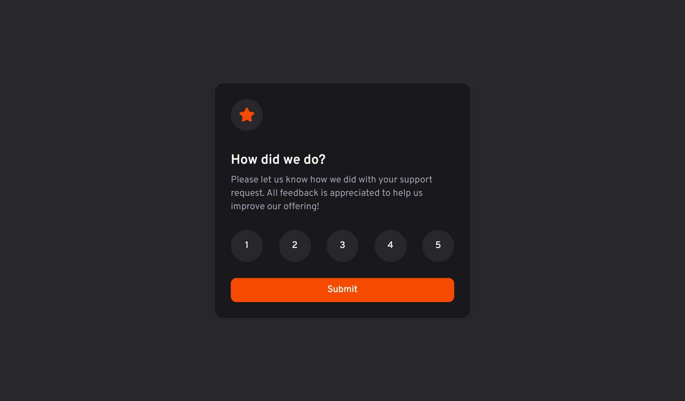

# Frontend Mentor - Interactive rating component



[To see my solution, click here! 😉](https://interactive-rating-component-cs.netlify.app/)

## 👩‍💻 The challenge

Your challenge is to build out this interactive rating component and get it looking as close to the design as possible.

Your users should be able to:

- View the optimal layout for the app depending on their device's screen size
- See hover states for all interactive elements on the page
- Select and submit a number rating
- See the "Thank you" card state after submitting a rating

## 🚀 Technologies

- Vite as build tool
- React for UI
- TypeScript for typesafety (not really needed, but ok)
- shadcn/ui for UI components

## 💻 Getting started

### Requirements

- [Node.js](https://nodejs.org/en/)
- [pnpm](https://pnpm.io/) or [npm](https://www.npmjs.com/) _(examples are with pnpm)_

**Clone the project and access the folder**

```bash
git clone https://github.com/marekzelinka/interactive-rating-challenge
cd interactive-rating-challenge
```

**Follow the steps below**

```bash
# Install the dependencies
$ pnpm i

# Start the app
$ pnpm dev
```
